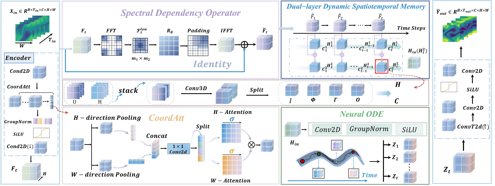
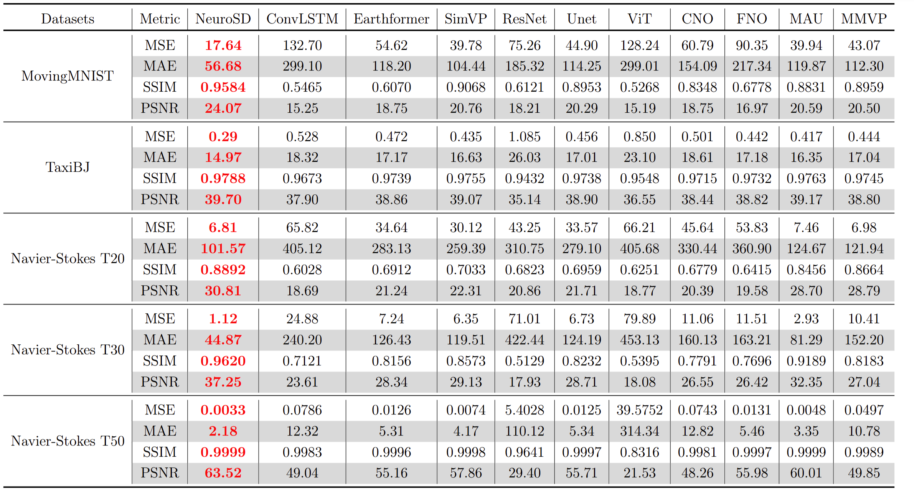
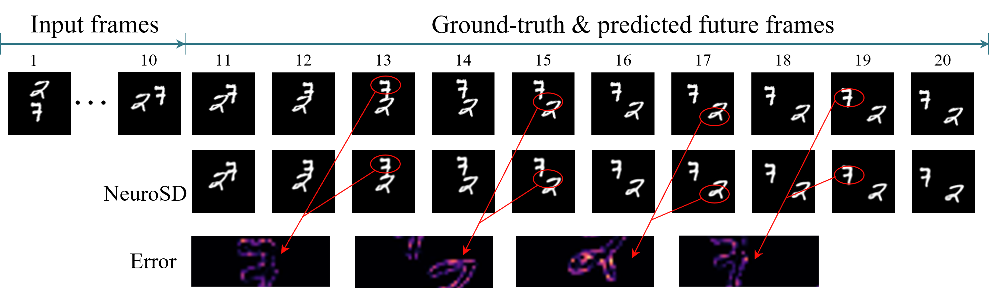
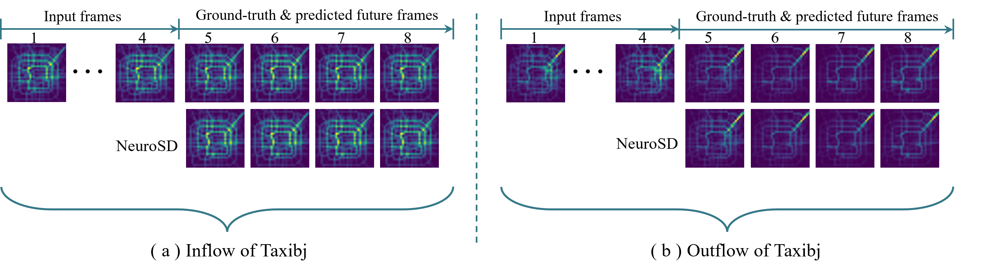
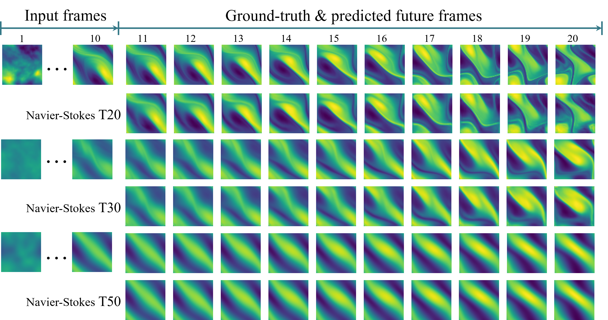
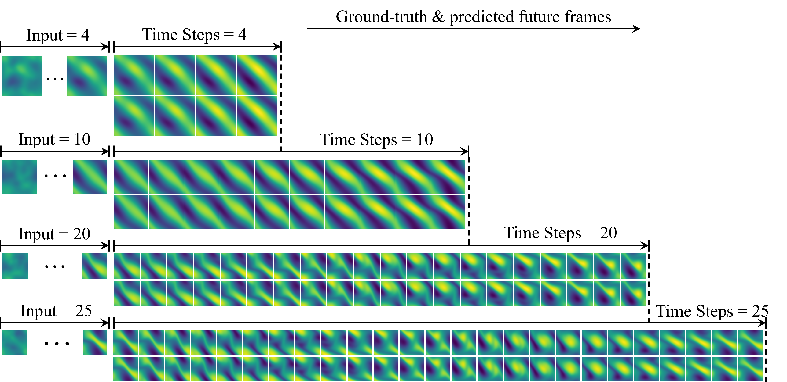
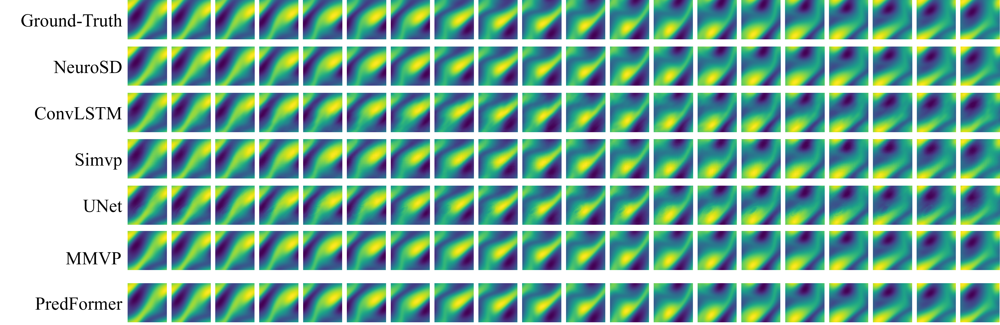
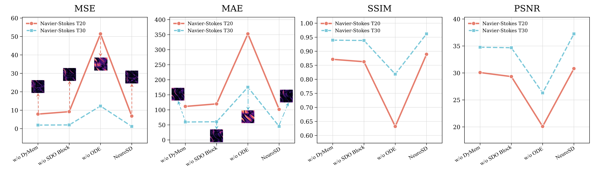

<div align="center">

#  🌀  NeuroSD

### A Neural Spectral Dynamics Framework for Spatiotemporal Prediction

<br>

<samp>5 datasets · spectral dependency · dynamic memory · continuous latent evolution</samp>

</div>

---

> **TL;DR — NeuroSD models spatiotemporal prediction through spectral dependency modeling and continuous latent evolution.**
> NeuroSD integrates a Spectral Dependency Operator Block, a Dual-layer Dynamic Spatiotemporal Memory module, and a Neural ODE-based latent evolution module to capture global spatial dependencies, aggregate historical dynamics, and improve long-term prediction stability.

<div align="center">
  
  <br>
  <em>Overall framework of NeuroSD.</em>
</div>

---

## 📌 Overview

Spatiotemporal prediction aims to infer future system states from historical observations and is widely used in video prediction, traffic flow forecasting, and fluid dynamics modeling.

NeuroSD addresses this task by combining spectral-domain global dependency modeling, dynamic historical memory aggregation, and continuous latent-space evolution. Specifically, the model first encodes historical observations into latent features, then applies the SDO Block to enhance global spatial dependencies. The DyMem module further aggregates historical dynamic information, and the Neural ODE module continuously evolves latent states for future prediction.

---

## 🧩 Framework Components

| Component  | Description                                                                  |
| :--------- | :--------------------------------------------------------------------------- |
| Encoder    | Encodes historical observations into latent feature space                    |
| SDO Block  | Captures global spatial dependencies in the spectral domain                  |
| DyMem      | Aggregates historical dynamic information with a dual-layer memory structure |
| Neural ODE | Performs continuous latent evolution for multi-step prediction               |
| Decoder    | Reconstructs future observations from evolved latent states                  |

The overall prediction process can be summarized as:

```text
Input sequence → Encoder → SDO Block → DyMem → Neural ODE → Decoder → Future prediction
```

---

## 📂 Repository Contents

```text
.
├── experiments/
│   ├── MovingMNIST/
│   ├── TaxiBJ/
│   ├── NavierStokes_T20/
│   ├── NavierStokes_T30/
│   └── NavierStokes_T50/
│
├── figures/
│   ├── framework.png
│   ├── main_results.png
│   ├── ablation_metrics_t20_t30.png
│   ├── qualitative/
│   └── long_term/
│
├── results/
│   ├── hyperparameters.md
│   ├── main_results.md
│   ├── long_term_results.md
│   └── ablation_results.md
│
├── README.md
└── requirements.txt
```

---

## 📊 Datasets

NeuroSD is evaluated on five spatiotemporal prediction datasets covering video prediction, traffic flow forecasting, and fluid dynamics prediction. The datasets used in this project are publicly available research datasets and are not created or owned by us.

For convenience, the processed dataset files used in our experiments are provided at:

[NeuroSD Dataset on HuggingFace](https://huggingface.co/datasets/Xiao1117/NeuroSD/tree/main)

| Dataset | Domain | Training size | Testing size | Channel | Height | Width | T_in | T_out |
| :--- | :--- | ---: | ---: | ---: | ---: | ---: | :---: | :---: |
| TaxiBJ | Traffic flow prediction | 20,461 | 500 | 2 | 32 | 32 | 4 | 4 |
| MovingMNIST | Video prediction | 10,000 | 10,000 | 1 | 64 | 64 | 10 | 10 |
| Navier-Stokes T20 | Fluid dynamics | 960 | 240 | 1 | 64 | 64 | 10 | 10 |
| Navier-Stokes T30 | Fluid dynamics | 960 | 240 | 1 | 64 | 64 | 4/10/20/25 | 4/10/20/25 |
| Navier-Stokes T50 | Long-term fluid dynamics | 1,600 | 400 | 1 | 64 | 64 | 4/10/20/25 | 4/10/20/25 |

> Note: The processed dataset files are provided only for research reproducibility. Users should also refer to the original dataset sources and comply with their corresponding licenses and usage terms.
---

## 🚀 Quick Start

### 1. Installation

```bash
git clone https://github.com/16lyx/NeuroSD.git
cd NeuroSD
pip install -r requirements.txt
```

### 2. Training

Train NeuroSD on MovingMNIST:

```bash
cd experiments/MovingMNIST
python train.py
```

Train NeuroSD on TaxiBJ:

```bash
cd experiments/TaxiBJ
python train.py
```

Train NeuroSD on Navier-Stokes T20:

```bash
cd experiments/NavierStokes_T20
python train.py
```

Train NeuroSD on Navier-Stokes T30:

```bash
cd experiments/NavierStokes_T30
python train.py
```

Train NeuroSD on Navier-Stokes T50:

```bash
cd experiments/NavierStokes_T50
python train.py
```

---

## ⚙️ Hyperparameter Settings

Detailed hyperparameter settings are provided in:

[results/hyperparameters.md](results/hyperparameters.md)

---

## 📊 Results

Detailed experimental results are provided in the `results/` directory.

| File                                                 | Description                                            |
| :--------------------------------------------------- | :----------------------------------------------------- |
| [main_results.md](results/main_results.md)           | Main comparison results on five datasets               |
| [long_term_results.md](results/long_term_results.md) | Long-term prediction results on Navier-Stokes datasets |
| [ablation_results.md](results/ablation_results.md)   | Ablation study results                                 |
| [hyperparameters.md](results/hyperparameters.md)     | Hyperparameter settings for all datasets               |

---

## 🏆 Main Results

We compare NeuroSD with representative spatiotemporal prediction models on five datasets. Detailed quantitative results are provided in [results/main_results.md](results/main_results.md).

<div align="center">
  
  <br>
  <em>Quantitative comparison between NeuroSD and baseline models on five datasets.</em>
</div>

## 🔍 Qualitative Results

We provide qualitative comparisons between the ground truth and the predicted results on different datasets.

### MovingMNIST

<div align="center">
  
  <br>
  <em>Qualitative prediction results on MovingMNIST.</em>
</div>

### TaxiBJ

<div align="center">
  
  <br>
  <em>Qualitative prediction results on TaxiBJ.</em>
</div>

### Navier-Stokes

<div align="center">
  
  <br>
  <em>Qualitative prediction results on Navier-Stokes datasets.</em>
</div>

## 🔁 Long-term Prediction

We further evaluate the long-term prediction ability of NeuroSD on the Navier-Stokes T50 dataset. Detailed numerical results are provided in [results/long_term_results.md](results/long_term_results.md).

<div align="center">
  
  <br>
  <em>Long-term prediction results of NeuroSD on Navier-Stokes T50 under different prediction horizons.</em>
</div>

<div align="center">
  
  <br>
  <em>Qualitative comparison between NeuroSD and baseline models on the Navier-Stokes T50 dataset.</em>
</div>


## 🧪 Ablation Study

We conduct ablation experiments to evaluate the contribution of the core components, including DyMem, SDO Block, and Neural ODE. Detailed numerical results are provided in [results/ablation_results.md](results/ablation_results.md).

<div align="center">
  
  <br>
  <em>Quantitative ablation results on Navier-Stokes T20 and T30.</em>
</div>

---

## 📜 Licenses & Acknowledgements

NeuroSD code is released for academic research and reproducibility purposes. The implementation is provided to support research on spatiotemporal prediction. Commercial use of this repository is not permitted without permission from the authors.

The datasets used in this project are not created or owned by us. MovingMNIST, TaxiBJ, and Navier-Stokes datasets are publicly available research datasets released by their original authors or maintainers. This repository does not redistribute the original raw datasets. Users should download the datasets from their official sources and comply with the corresponding dataset licenses and usage terms.

The processed dataset files used in our experiments are provided through our HuggingFace repository for reproducibility: Xiao1117/NeuroSD. However, these datasets are not created or owned by us. Users should cite and follow the original dataset sources when using them.

Some baseline models and experimental settings are adapted from publicly available research codebases and retain their original licenses. We thank the authors of the open-source datasets, baseline implementations, and related spatiotemporal prediction frameworks.

<div align="center">
<br>
<sub>NeuroSD aims to improve spatiotemporal prediction through spectral dependency modeling, dynamic memory aggregation, and continuous latent evolution.</sub>
</div>
